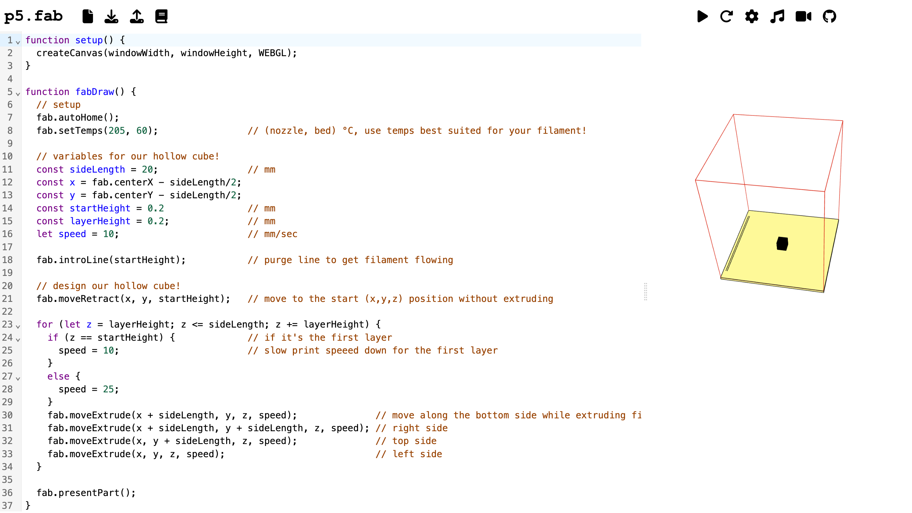

# Resources
Here you'll find some resources for using p5.fab. I recommend starting with the <a href="./#tutorials">tutorials</a>. There's also some <a href="./#additional-resources">background information</a> on creative coding and digital fabrication, with links to learn more.

The resources here are growing; if there's something you'd like to see added or contribute, reach out on <a href="https://github.com/machineagency/p5.fab">github</a>!

## Tutorials

    <a href="./tutorials/getting-started-tutorial">
    
Getting Started

        <figure>
            
            <figcaption>
                Using the online editor, connecting to the machine, and sending first commands.
            </figcaption>
        </figure>
    </a>

    <a href="./tutorials/interactive-cube-tutorial">
    
Interactive Cube

        <figure>
            <figcaption>
                Modifying print parameters with a MIDI controller.
            </figcaption>
        </figure>
    </a>

<!-- ## [Line Vase 3D Print](tutorials/line-vase-tutorial)
Tuning printing parameters to create delicate structures. -->

## Examples

    <a href="./tutorials/cube-tutorial">
    
Printing a Cube

        <figure>
            <!--  -->
            <figcaption>
                A first 3D printed object with p5.fab.
            </figcaption>
        </figure>
    </a>

    <a href="./tutorials/non-planar-tutorial">
    
Non-Planar Printing

        <figure>
            
            <figcaption>
                Putting the '3D' in 3D printing.
            </figcaption>
        </figure>
    </a>

## Additional Resources
### [p5.fab Primer](guides/p5fab-primer)
An overview of the p5.fab library.

### [A Brief Introduction to Digital Fabrication](guides/dfab-intro)
A (very!) brief overview of some key digital fabrication concepts, including: G-Code, coordinate systems, machines, and their firmware. Intended for anyone new to using machines like 3D printers.

### [A Brief Introduction to Creative Coding with p5.js](guides/cc-intro)
A (very!) brief overview of some key creative coding concepts, including: how to sketch with p5.js. Intended for anyone new to creative coding. 